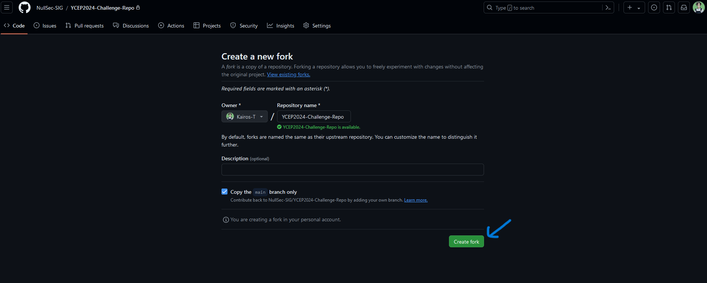
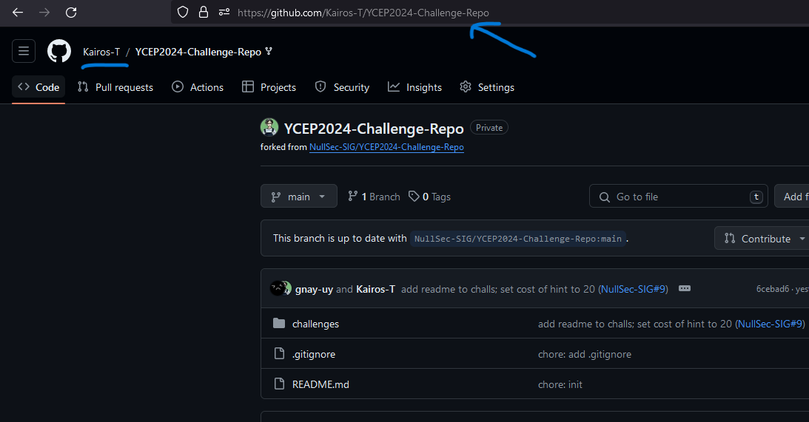
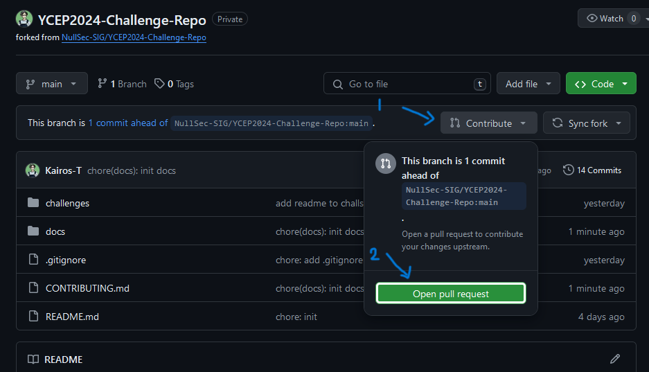
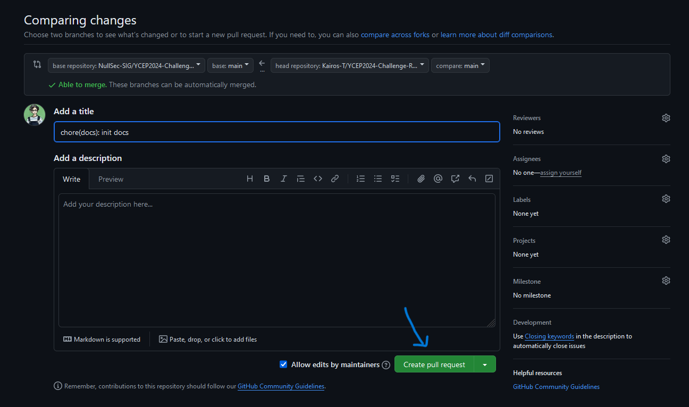

# Contributing Guide

First off, thank you for considering to contribute to NullSec's YCEP run. We appreciate your time and effort. 

This contributing guide is a walkthrough of how to contribute to this repository.

Pre-requisites:
- Git installed on your machine

## Table of Contents
- [Setting Up](#setting-up)
- [FAQs](#faqs)

## Setting Up

1. Fork the repository. No configuration or settings edits are needed.
    
    

2. Clone the forked repository to your local machine. Ensure that you are cloning the forked repository and not the original one. `cd` into the directory you want to keep the repo in, and clone it with the command below.
    
    ```powershell
    git clone <url-of-forked-repo>
    ```
3. Make your changes (editing/adding of challenges, etc.) and commit them.
    ```powershell
    git add . # Or git add <file-name>
    git commit -m "Your commit message"
    git push
    ```
4. Go to your forked repository on GitHub and create a pull request. No configuration/setting edits are needed.
    
    

5. You're done! Your pull request will be reviewed and merged if no changes are needed.

## FAQs

1. **Do I need to create a new PR if I need to make changes to my existing PR?**
    - No, you can simply push the changes to the branch of the PR. The PR will automatically update with the new changes.
2. **How do I keep my forked repository up-to-date with the original repository?**
    - You can do this by adding the original repository as an upstream and pulling changes from it. Here's how you can do it:
        ```powershell
        git remote add upstream https://github.com/NullSec-SIG/YCEP2024-Challenge-Repo
        git pull upstream main
        ```