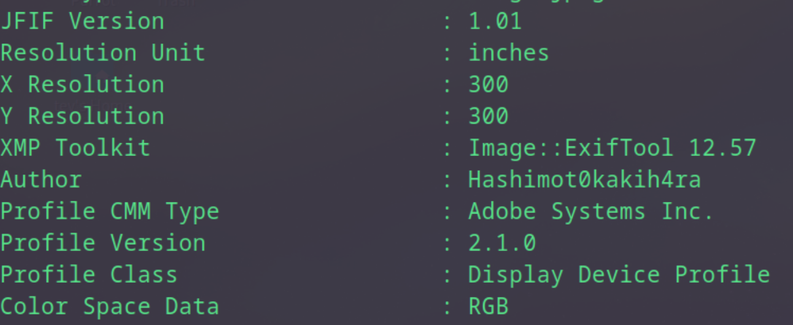
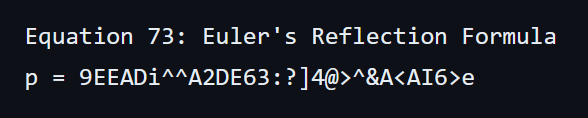
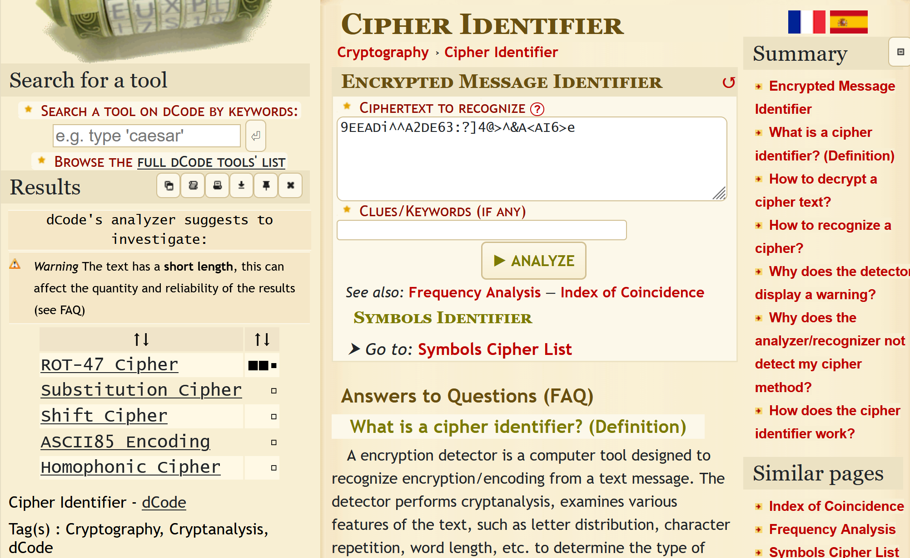

## Mission Impossible solution
The challenge involves finding the GPS coordinates of where the last clue of the World Domination plan lies.

### 1. Obtaining the original author of the image
We can firstly use exiftool on the given image to obtain the orginal author of the image, **[Author: Hashimot0kakih4ra]**, which gives us his 'online' name.

### 2. Using his online name to find if he has any other public accounts  
Using his online name, we can use many different tools to perform a search on it. One of it is **[https://namechk.com/]**. Doing a quick search on his name, will yield many different website result suggestions. You can go through them individually to find anything suspicious. The one of concern here, is his github account. When searching for his name on github, it brings us to his original account **[https://github.com/Hashimot0kakih4ra]**.

### 3. Navigating through his github 
In the github, we will find a pinned repository called 'flag'. Going through it gives us many random directories with a flag.txt. You can recursively go through each one and try the flag but realized they are all fake. Even the other version of the base-64 encoded flag is not a real flag (Which would just waste your time). It's just a troll repo.

In the repository tab, there is a plans repository with many different directories in it. The one of interest is the **[Widow's Kiss]** which contains the information.txt. 

This is where it starts to get very tricky. Information.txt shows 100 different math equations. The goal is to find a encoded piece of string hidden that will yield a link. 

### 4. Finding the hidden message and decoding it
Looking through the 100 different equations, some of them look like there are hidden base64 encoded inserted into the equations, however, none of them will yield useful results. You can use regex to fine tune the equations, erasing all the real math formulas, narrowing it down.

There is a equation that looks very perculiar though, equation 73: 
**"p = 9EEADi^^A2DE63:?]4@>^&A<AI6>e"**. We can put it through dcode, a tool, to identify the encoding used for this.

We can see that the likely encoding is ROT47. Decoding it will result us in this link -> **[https://pastebin.com/Upkpxem6]**

### 5. The diary entry
Visiting the pastebin will reveal a diary entry. At first glance it looks like just a bunch of meaningless text, however, in order, there are certain words that are capitalized which will reveal a string of **"hashipoopiesauce"**. However this string does not tell us much on what to do with it.

### 6. Solving the riddle
At the bottom of the diary, there is a riddle enclosed in "*". Solving the riddle will realize that the plan lies on instagram. 

### 7. Putting it together
Given the string obtained and the riddle answer, we can put "hashipoopiesauce" in the instagram search to obtain his account. 

### 8. Finding the exact coordinates
The post on the instagram tells us that to get the flag, we will need to get the exact coordinate location in the image. We can reverse search the image to find where this location is. Its actually ngee ann poly (which you should have walked past coming here)! Going to google maps and using **street view**, we can tinker around the different street views to find the exact coordinates, which can also be found in the address bar after finding the exact view/way the image is facing!

**YCEP24{1.333697,103.7758168}**

