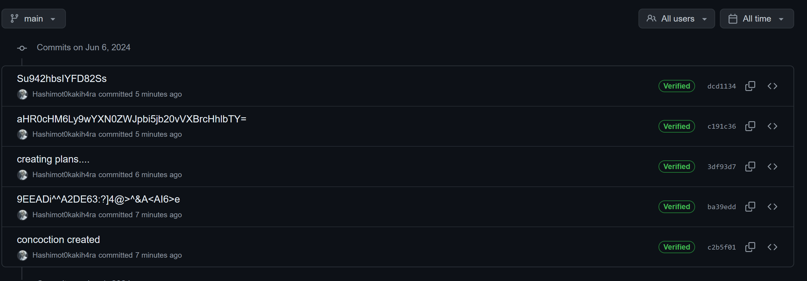
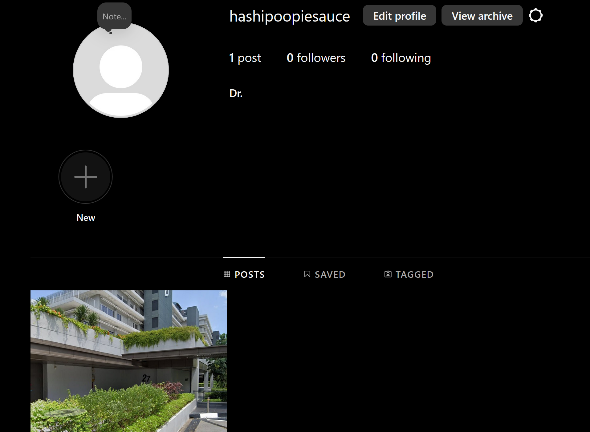

## Mission Impossible solution
The challenge involves finding the GPS coordinates of where the last clue of the World Domination plan lies.

### 1. Obtaining the original author of the image
We can firstly use exiftool on the given image to obtain the orginal author of the image, **[Author: Hashimot0kakih4ra]**, which gives us his 'online' name.

### 2. Using his online name to find if he has any other public accounts  
Using his online name, we can use many different tools to perform a search on it. One of it is **[https://namechk.com/]**. Doing a quick search on his name, will yield many different website result suggestions. You can go through them individually to find anything suspicious. The one of concern here, is his github account. When searching for his name on github, it brings us to his original account **[https://github.com/Hashimot0kakih4ra]**.

### 3. Navigating through his github 
In the github, we will find a repository that called plans and in it shows many different directories, however none of them yields anything useful. However, we can also see the commit historys made to this repository. 

We can see from here that there are many different string of characters and one of them looks like a very familiar encoding, base64, due to the "=". We can try and put this through a base64 decoder.

Decoding it will result us in this link -> **[https://pastebin.com/Upkpxem6]**

### 5. The diary entry
Visiting the pastebin will reveal a diary entry. At first glance it looks like just a bunch of meaningless text, however, in order, there are certain words that are capitalized which will reveal a string of **"hashipoopiesauce"**. However this string does not tell us much on what to do with it.

### 6. Solving the riddle
At the bottom of the diary, there is a riddle enclosed in "*". Solving the riddle will realize that the plan lies on instagram. 

### 7. Putting it together
Given the string obtained and the riddle answer, we can put "hashipoopiesauce" in the instagram search to obtain his account. 

### 8. Finding the exact coordinates
The post on the instagram tells us that to get the flag, we will need to get the exact coordinate location in the image. We can reverse search the image to find where this location is. Its actually ngee ann poly (which you should have walked past coming here)! Going to google maps and using **street view**, we can tinker around the different street views to find the exact coordinates, which can also be found in the address bar after finding the exact view/way the image is facing!

**YCEP24{1.333697,103.7758168}**