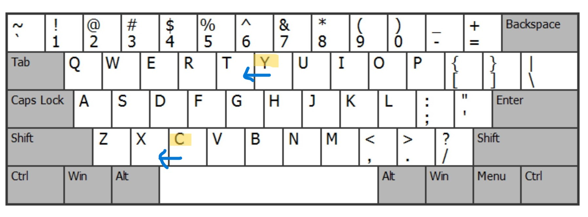
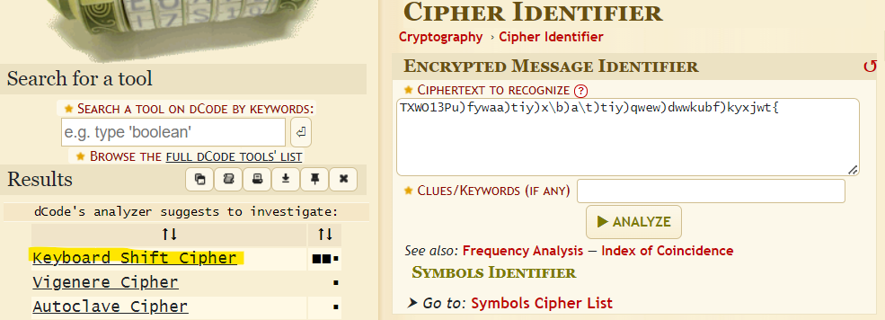
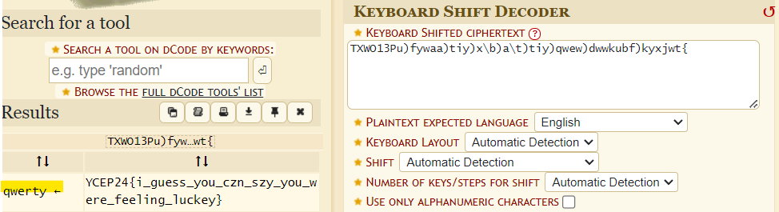

# Keyboard Warrior Solution

1. The challenge title hints a cipher related to "keyboard". Knowing that the flag format is YCEP24{}, we can guess that the first 6 characters of the given ciphertext `TXWO13` maps to `YCEP24`. We can deduce that the relationship between the plaintext and ciphertext is **keyboard shift (QWERTY), by 1 key left**

2. Referring to the QWERTY keyboard layout, shift each ciphertext character **1 key right** to get the flag.

- Alternatively, running the ciphertext through dCode.fr's cipher identifier correctly identifies a Keyboard Shift Cipher. 
- However for some reason it maps plaintext `a` as plaintext `z`, but participants are able to see that it is encoded left shift by 1 key, and are expected to correct this themselves.

