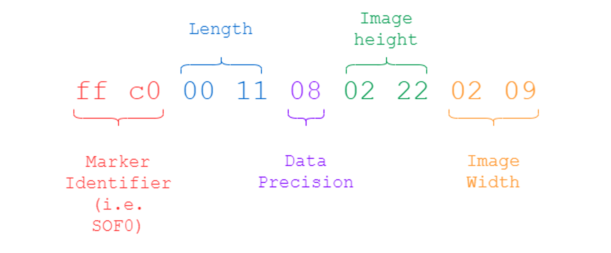
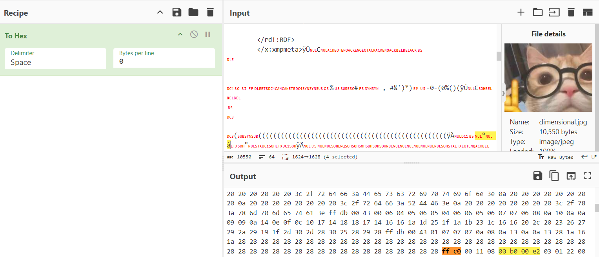
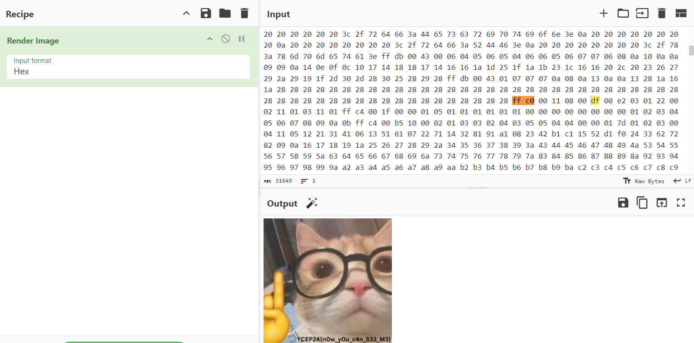

# Dimensional Solution

1. A jpg image is given, with the dimensions 176 x 226. The challenge description hints that the desired (original) dimensions are 223 x 226, hinting that the height is cut off.
2. We have to find where the height is indicated in the JPG image, based on the JPEG Start of Frame (SOFO) markers (`0xFF 0xC0`)

3. Using a hex editor or tool, locate the SOFO markers `ff c0`: analysing the given image's hex:
    `ff c0 00 11 08 00 b0 00 e2` => given image dimensions are 176 (`0xb0`) x 226 (`0xe2`)

4. Edit the image height to 223 (`0xdf`) in hexadecimal: `ff c0 00 11 08 00 df 00 e2` 

5. Flag can now be viewed after restoring the image height.

Reference/Inspiration: https://cyberhacktics.com/hiding-information-by-changing-an-images-height/
