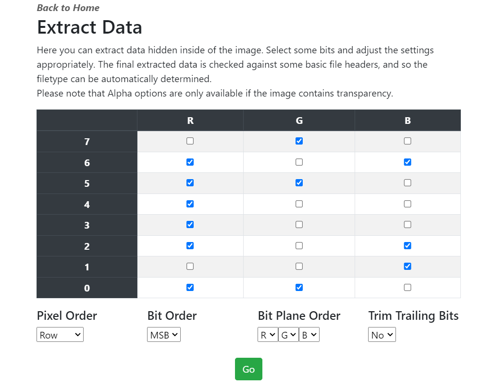

# EatingPlanes
1. Put the file into stegonline (https://georgeom.net/StegOnline/upload) or user Cyberchef, both work.
2. If you are on StegOnline, click the browse bit planes button, or if you are on Cyberchef, add the View Bit Planes recipe. For this writeup, we will continue with stegonline, but you can do the same in Cyberchef as well.
3. If we cycle through all the bit planes, we can see there is some commonality between some of the planes..

4. Now, click the extract files/data button, you should see a 8x3 grid 
5. Tick the boxes in whichever the commonality was visible. For example, we could see it in Red 0, Red 2, Red 3 and so on. It should look like the following,

6. Click extract data and you should get the flag, YCEP24{ImB1T1nGtHePl4ne}