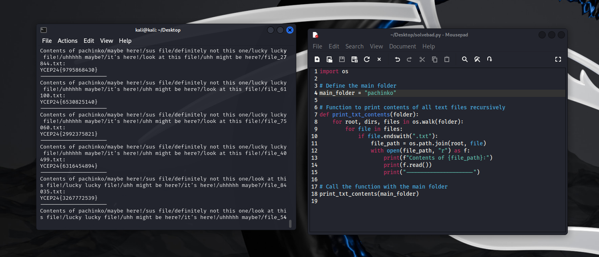

# solution

1. We are provided with a zip file, `pachinko.zip`. unzipping the file uncovers what appears a bunch of nested folders and a BUNCH of fake flags :c

2. Let's first try to write code to print out all of the flags and run it
   
   
   
   

3. We notice how the fake flag format seems to be comprised of numbers. Let's filter them out.
   
   
