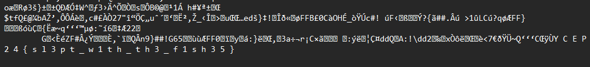
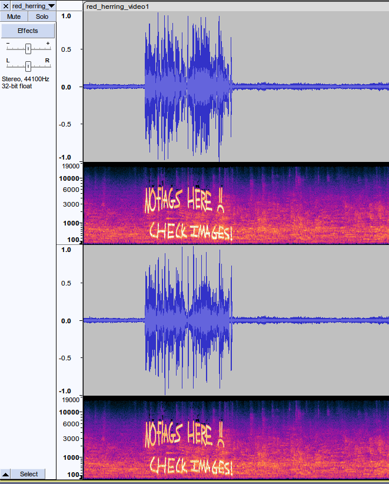
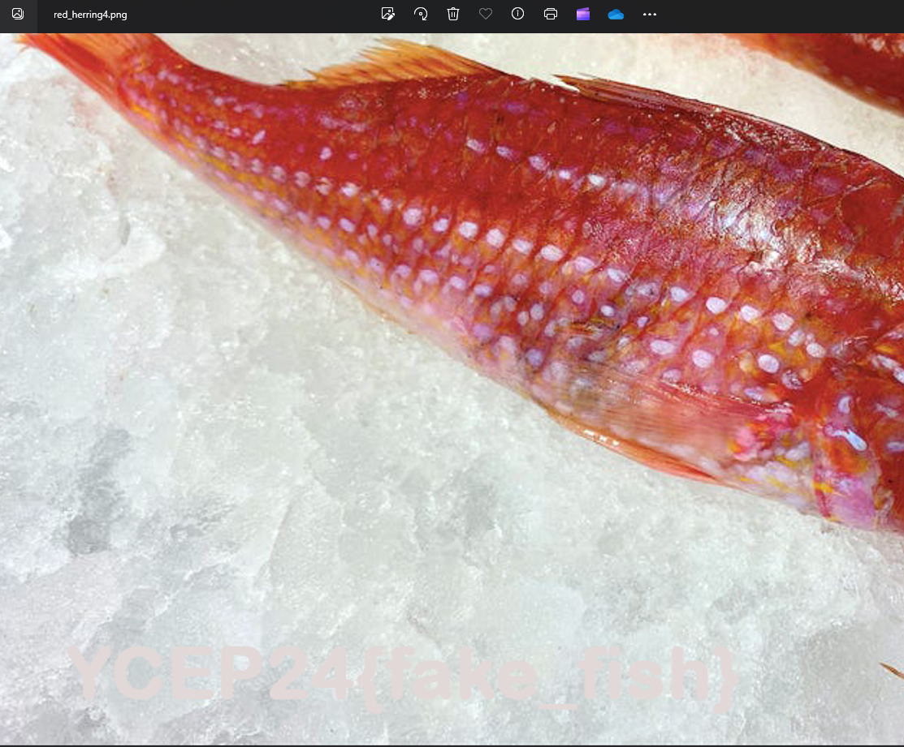
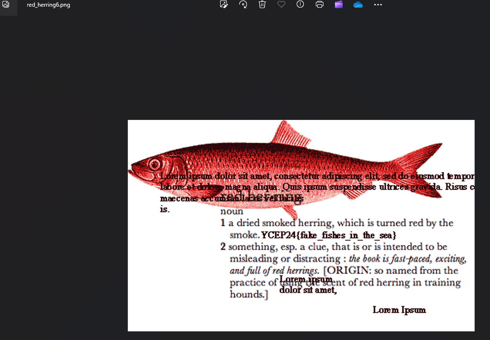

# solution

1. We are provided with a zip file, `redherring.zip`. unzipping the file uncovers what appears a bunch of fishy images and videos.
   
   

2. There are a bunch of fake flags, so before going through each one of them, ill go through the solution first

## REAL FLAG!!!!!

- If you open `red_herring3.jpeg` in notepad or `cat` it you will see the flag format at the end of the file
  
  

## FAKE FLAG #1

- in `red_herring_video1`, at around 3 seconds, there is what seems to be weird noises. Opening the audio in audacity reviews a message, but not the flag :c

- It tells us that there are no flags and a hint to check the images more throughly.
  
  

## FAKE FLAG #2

- In `red_herring2.jpeg`, if you look under the property tab, you will see another fake flag :3
  
  

## FAKE FLAG #3

- In `red_herring4.png`, if you look at the actual image, you can see that theres a flag format hidden in the bottom left corner. Fake though hehe

## FAKE FLAG #4

- In `red_herring6.png`, the image is pretty messy, but there seems to be a flag format in the middle of the screen. hmm i wonder if that flag is real?

