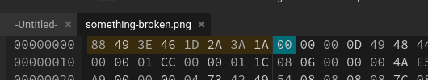

# Something Broken Solution

1. Notice that the image cannot be opened, so it is likely that we need to repair it first.
2. Use a hexeditor, like [HexEdit](https://hexed.it/) to view the hex codes of the image.
3. Notice the first eight bytes of the image are NOT `89 50 4E 47 0D 0A 1A 0A`, which is the magic number for PNG files.
    
4. Replace the first eight bytes with `89 50 4E 47 0D 0A 1A 0A` and save the file.
5. Profit
    