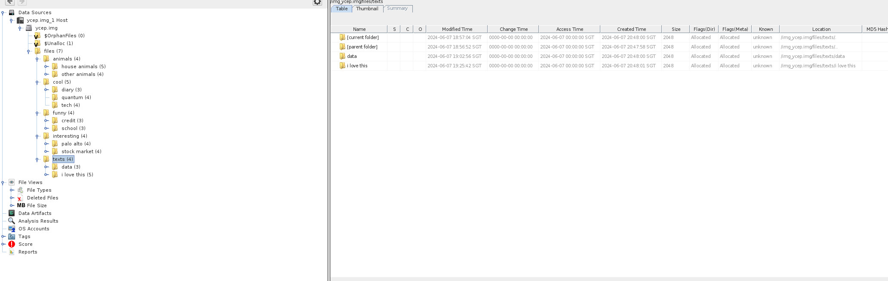
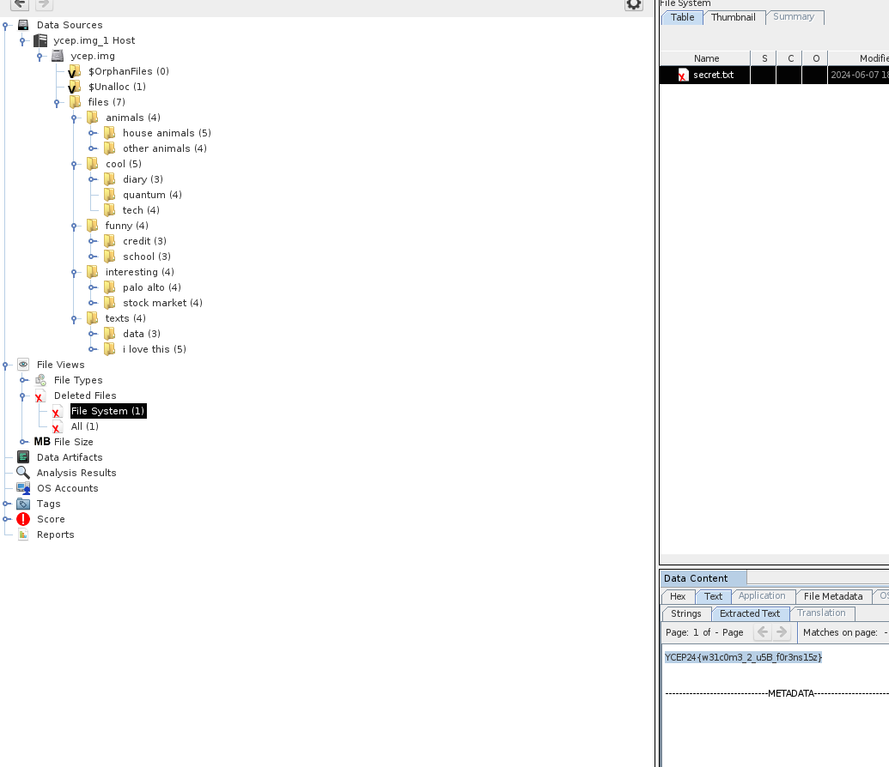

# Something Missing Solution

1. Unzip the file with `unzip something-missing.zip`.
2. Check the file type and details with `file ycep.img`. The output should be something like this:
```
ycep.img: DOS/MBR boot sector, code offset 0x3c+2, OEM-ID "mkfs.fat", sectors/cluster 4, reserved sectors 4, root entries 512, Media descriptor 0xf8, sectors/FAT 204, sectors/track 32, heads 64, hidden sectors 2048, sectors 208896 (volumes > 32 MB), reserved 0x1, serial number 0x17a5e0eb, label: "yceppy     ", FAT (16 bit)
```
This gives us some information about the image type. 
3. We should start with mounting the image file onto Autopsy. 
4. Once we have mounted it, we can see that there are a bunch of folders in it, and it might be a little too tedious to run through every single thing.

5. The challenge hints towards some deleted file. Though a file is deleted, it is not actually... deleted. If you're interested in the theory behind it, check out this [article](https://www.howtogeek.com/125521/htg-explains-why-deleted-files-can-be-recovered-and-how-you-can-prevent-it/)
6. Autopsy has a really nice feature to parse the deleted files, so simply finding that tab would show us the deleted files, as with their content.
