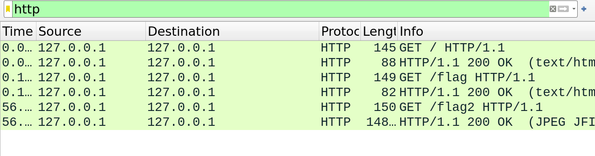

# Something Stanky Solution

1. A pcap file is provided, so the easiest way to view the contents is to open it in Wireshark.
2. Right off the bat, there are a bunch of TCP, UDP, ICMP, DNS, and HTTP traffic.
3. Usually, we want to look out for HTTP traffic since it is most likely to be unencrypted, and we could probably extract some data from it.
4. Filtering for HTTP traffic from wireshark, we can see some requests to `/flag` and `/flag2`.


5. It seems like some text and an image is being sent, so we can either follow the TCP stream or extract the files.
6. To extract the files, `File -> Export Objects -> HTTP` and save the files. 3 files get saved: `%2f`, `flag` and `flag2`.  
7. Checking the file types:
```bash
kairos@pop-os ~/Downloads> file \%2f flag flag2 
%2f:   ASCII text, with no line terminators
flag:  ASCII text, with no line terminators
flag2: JPEG image data, JFIF standard 1.01, aspect ratio, density 1x1, segment length 16, progressive, precision 8, 834x742, components 3
```
8. Lets `cat` the text files:
```bash
kairos@pop-os ~/Downloads> cat %2f flag
Welcome to YCEP2024!YCEP24{h41f3d_⏎ 
```
9. The image looks like this


So let's strings the image. At the end there is a string: `n3tw0rk_f0r3ns1c5}`

10. Join the two strings together to get the flag.