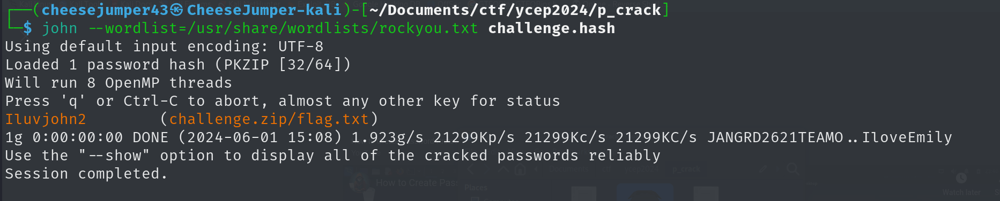
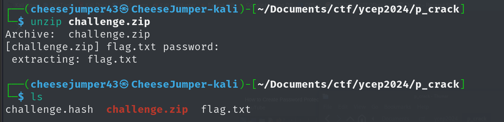
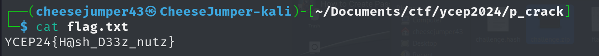

# John the cat solution

1. We are provided with a zip file, `challenge.zip`. Attempting to unzip the file would result in us being prompted with a password that is to be provided

2. We do not have a password provided. ☹️  

  

3. In order to even begin cracking the password, we have to first retrieve the hash in a crackable format. We'll use `johntheripper` for this challenge. In order to retrieve the hash of the zip, we will be utilizing `zip2hash`  
> zip2john challenge.zip > challenge.hash (Transfer the hash into a file to be cracked later on)  

 

4. Run John the ripper against the retrieved hash, using the `rockyou.txt` wordlist
> The rockyou wordlist can usually be located in `/usr/share/wordlists` for kali machines (The wordlists might be zipped due to its large size, follow this website to unzip the wordlist for first time users: https://www.geeksforgeeks.org/how-to-extract-rockyou-txt-gz-file-in-kali-linux/)  

 

5. With the password retrieved, we can try to unzip the file once again, and view its contents  

 

6. The flag can be retrieved from the `flag.txt` file  

> cat flag.txt  

