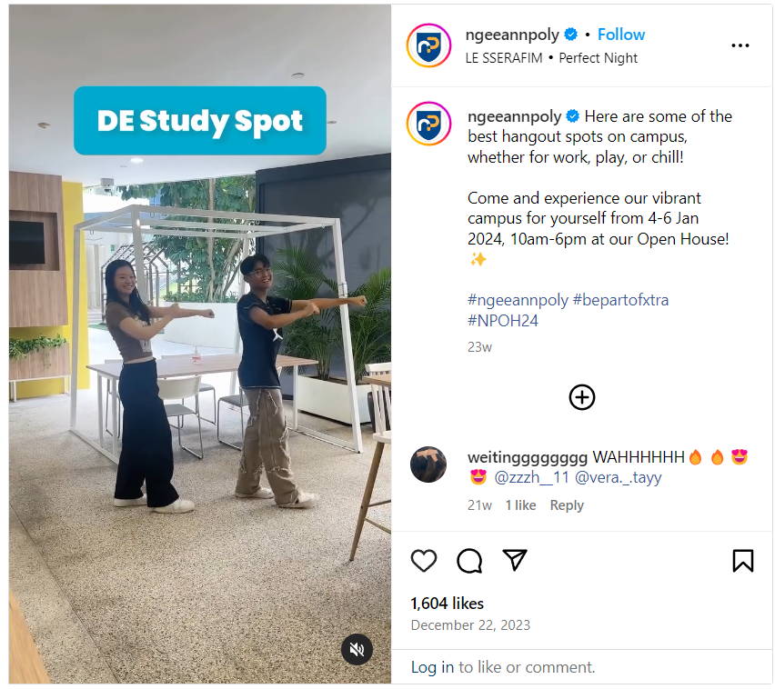

# CAPTURE The Flag

The initial idea behind this challenge was from a chat I had with Yu Yang, and it was just for lols; until the idea got approved. This challenge includes a fun twist on the classic GeOSINT / Social Media challenges.

## Solution
The location of the picture is the outdoor study area at the School of Design and Environment, behind the gallery, on level 1.

1. The challenge description tells us that the location is somewhere within the Ngee Ann Campus. We know that it is a "hangout area" from the challenge description.
2. Doing a google search on "Ngee Ann Poly Hangout spots outdoors" will yield this particular Instragram reel from December 2023: https://www.instagram.com/ngeeannpoly/reel/C1JomTVBMNL/. There is also a less recent feature from July 2023: https://www.instagram.com/ngeeannpoly/reel/CugKzM8gecC/?next=%2Fp%2FCPGWXObLarf%2F&hl=hr
3. In the reel, "DE Study Spot" looks similar to the given picture:

1. Participants can go down to the study area to get the flag.