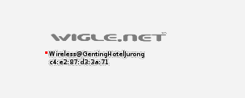

# silly address Solution

1. Take down BSSID, and enter it into [Wigle.net](wigle.net)
2. Click `View` > `Basic Search`, and add the BSSID Into the BSSID/MAC field. Click query.
3. Zoom into the purple circle to see the SSID.

