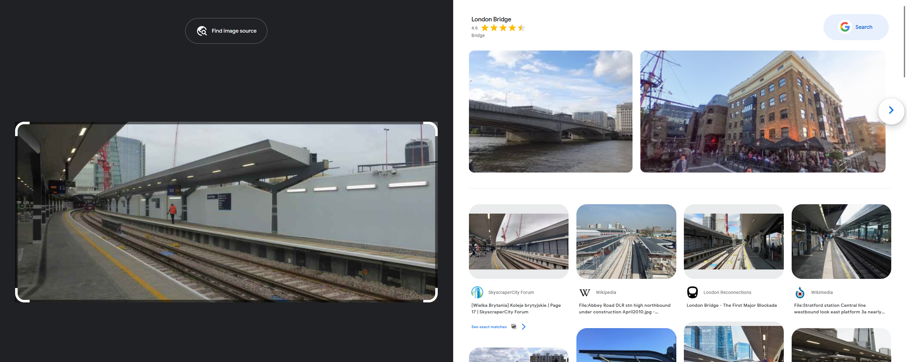
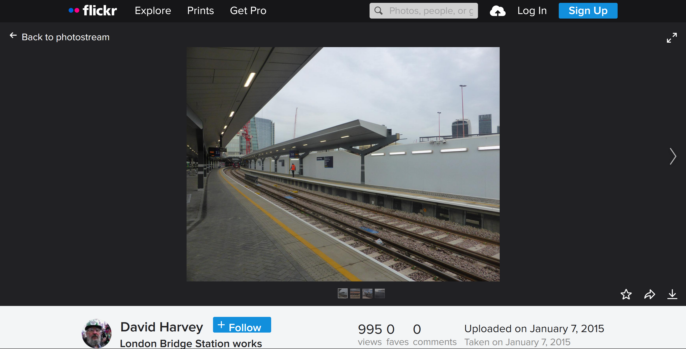
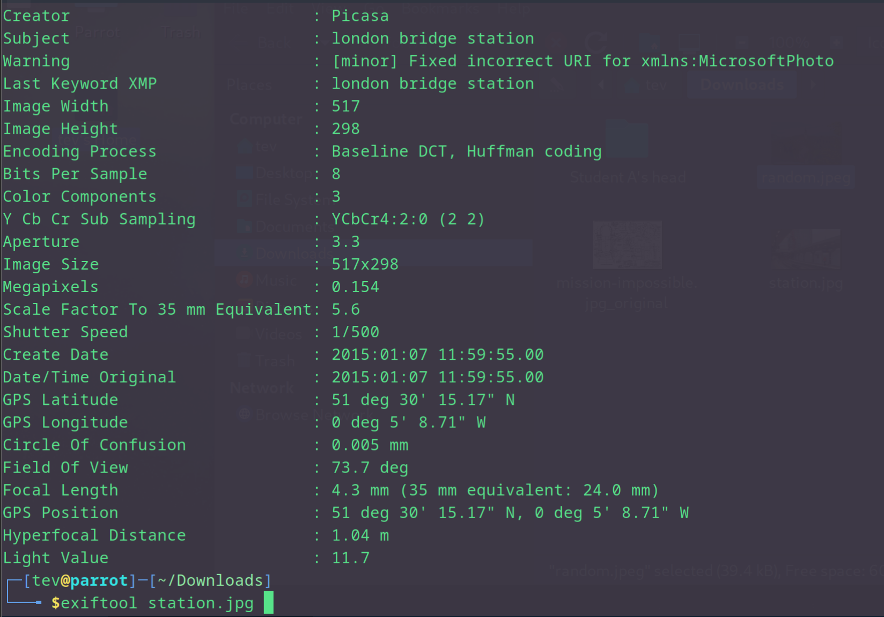

## train exif this way solution
The challenge involves identifying the exact location depicted in an image of a train station using flickr, finding the author and then extracting metadata from the original to finally obtain the GPS position.

### 1. Identify the train station
Begin by performing a Google reverse image search using the provided PNG image. This will help identify the exact name of the station depicted in the image. The search reveals that the station is the 'London Bridge Station'.

### 2. Find the original image  
Once the station is identified, the next step is to find the original image or a similar one on Flickr. Search for photos tagged or titled with "London Bridge Station" to locate the exact or similar image posted by a user on Flickr.

### 3. Download the original image  
After locating the image on Flickr, download the original image file to your local system. Ensure that the image file retains its original metadata by avoiding any editing or modifications.

### 4. Extract metadata  
Utilize a tool like 'exiftool' or any other tool that can extract metadata to extract it from the downloaded image. Exiftool will reveal the GPS position coordinates.

#### Original photo
https://www.flickr.com/photos/unravelled/16224969812/in/photolist-qHKdfQ-pLPrSo-2nutMS1-zJpZn6-qHPq8H-rrAH7B-qHKhzS-qHPmc6-qrnzgz-qHKeVy-qrfkEE-qrg6Eq-qrg8zY-pM3vcc-quB7WQ-pM3wke-2p5W4BG-zJfqKG-2p4HwLH-2oj34f3-2kttTno-2obEuTA-AyhikL-2imUdnc-RkXHvx-2ppwRhL-2jRAf8N-Liwbu9-UHeNSc-2jQnyuJ-2nrJ4CT-J21LuX-QgRt7Z-t7zLdv-Xmn1z6-2pQh8uc-xBs2uH-28xedoN-wzJ8KZ-2paQouF-23MKZjg-ruYwmX-r5fep9-LLcpTz-toKihy-2oV87p9-smfVEp-2ihiBpD-2nnKsMG-qU6Mkg/

