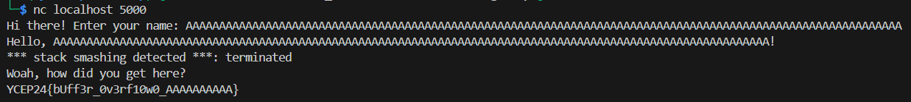

# Baby Pwn Solution
A simple buffer overflow challenge.

1. Analysing the given source code shows that a buffer of 100 characters is set `char buf[100]` in `vuln()`.
2. The `gets()` function is used to read input into this buffer. It is vulnerable as there is no maximum size before it stops reading (unlike fgets), so it is possible to read input greater than the allocated buffer, causing a buffer overflow.
3. The `flag()` function will be called when a segmentation fault occurs (when a program tries to access an illegal memory location),for instance by causing a buffer overflow.
4. Possible payload: `b'A'*150`, can enter this manually or using a script.

