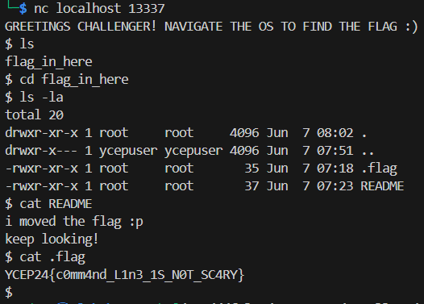

# CLI
This challenge serves as an introduction for participants to familiarise themselves with the command line and connecting to a challenge with netcat.

# Solution
1. Upon connection, we get a Linux shell
2. Navigating around the directory, there is a hidden file `.flag` in /flag_in_here, viewing it gives the flag.

