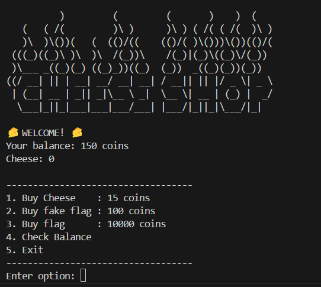
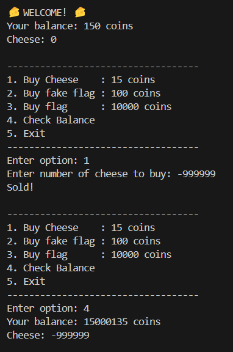
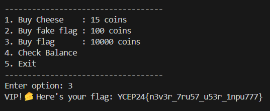

# Cheese Shop 
Simple program with insufficient logic and input checks.

# Solution
1. Upon connection, the program gives the following options:

- Note that the given balance is 150 coins, but we need 10000 coins to get the real flag. With the given amount of coins, players can only buy cheese and a flake flag. The goal is to try to get the program to run option 3 to buy the real flag.

2. Playing around with the program with all sorts of input values, participants will realise that the "Buy Cheese" option is vulnerable to insufficient logic checks: 

3. Buying negative numbers of cheese will let us get more money; players will now have enough coins to buy the real flag.

