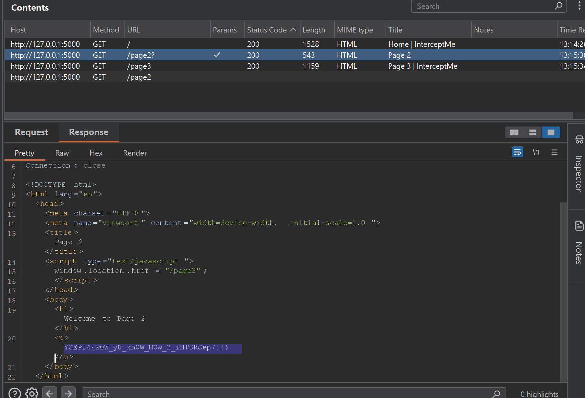

# InterceptMe Solution

1. Use Burp Suite browser to access the website. Click on the button to bring you to page 2.
2. Page 2 immediately redirects you to page 3, but the HTTP history is shown in Burp Suite, containing page 2's content.
3. Within Page 2's content, the flag is there!
    