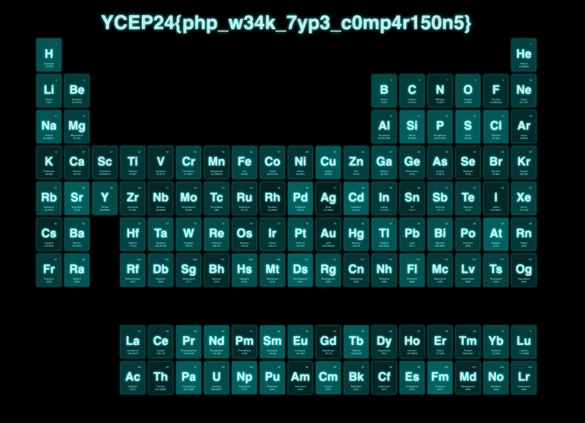

# Magic Table

This challenge aims to increase the awareness of weak type checking
in languages such as PHP and Javascript. Participants should be
aware of the issues of using `==` instead of `===`.

## Challenge Overview

The webpage has clickable periodic table elements that allow the user
to interact with an API. Upon clicking, a URL parameter of `element1`
is added, and a request to `/api.php` is made with that parameter.
The value of the `<h1>` tag is updated accordingly.

When visiting the source code of `api.php`, we see that only the parameters
`element1` and `element2` are of interest.

```php
if (($element1 !== $element2) && ($element1 == $element2)) {
    echo "YCEP24{fake_flag}";
} else {
    echo "The elements are not equal";
}
```

We see that `element1` and `element2` should not have the exact same value,
but somehow evaluates to `true` with weak type checking.

## Solution

In PHP, weak type checking between two values starting with `0e...` always
results in `true`. Thus, we can pass in two elements such as `0e1` and `0e2`,
and we'll get the flag.



