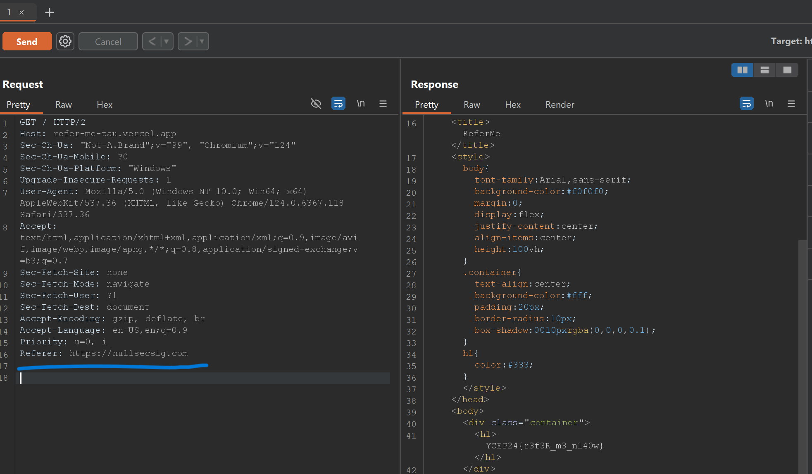

# ReferMe Solution

1. Use Burp Suite to capture the GET request of the page. 
2. Right click on the request and select "Send to Repeater".
3. Add `referer: https://nullsecsig.com" to the header.
4. Send the request and check the response.
    