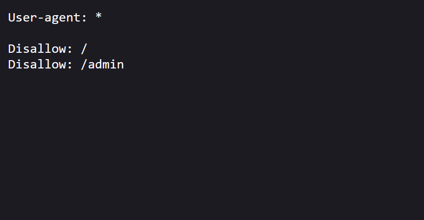
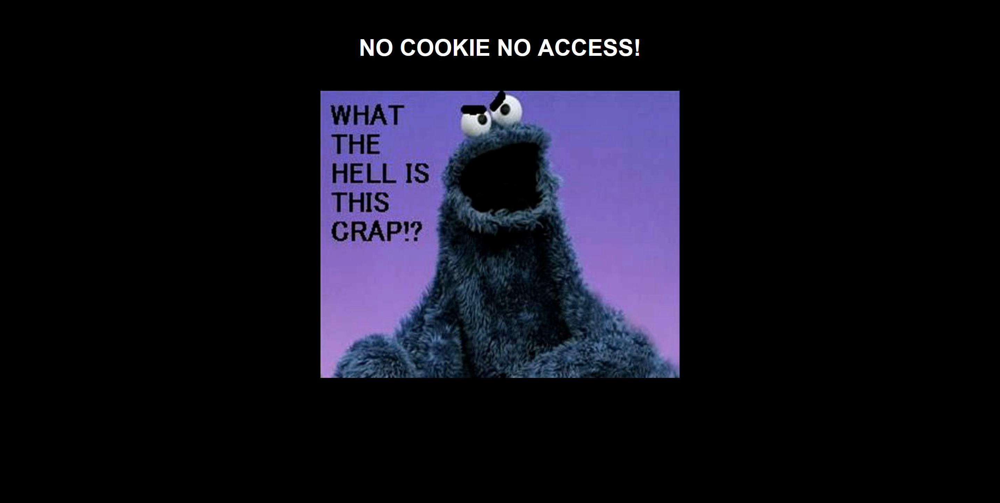
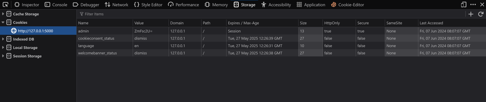
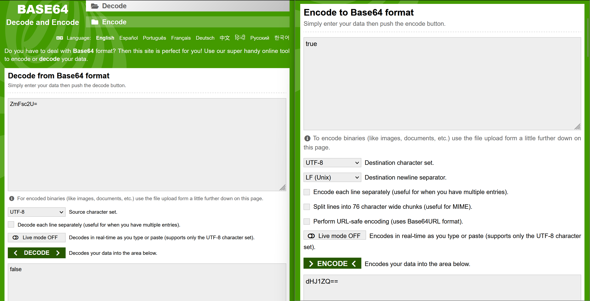
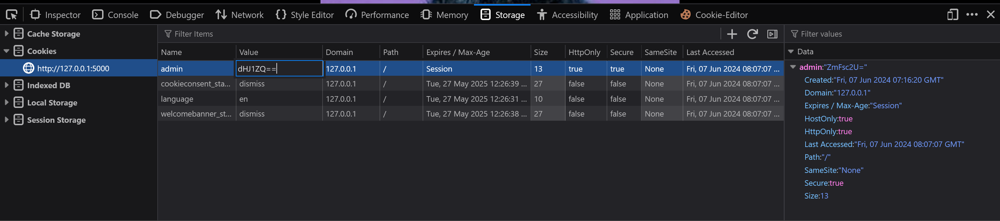
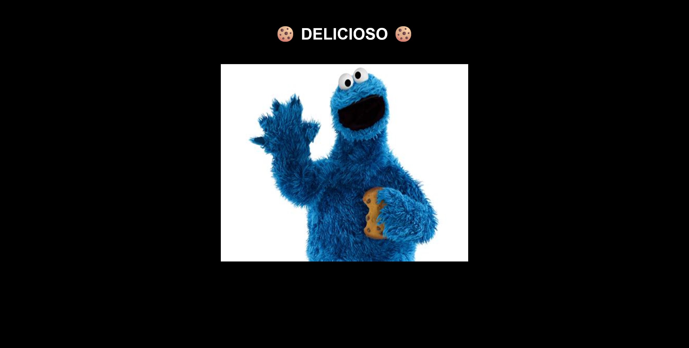
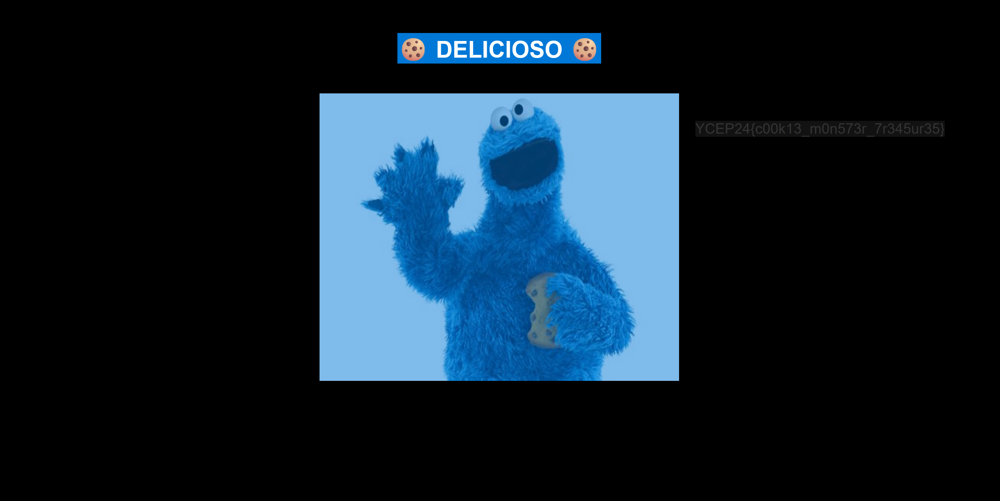

## Cookie Monster solution
The challenge involves modifying cookie values to obtain admin access.

### 1. Web page
Visting the web page show us an image of a cookie monster. Also, the challenge name, 'cookie monster' gives us a hint that the challenge will be related to cookies.

### 2. Robots
We can visit the robots.txt page (/robots.txt) to see if there are any pages that are unindexed by web crawlers.

There seems to be a /admin page that we can visit!

### 3. Admin page
However, when visiting the admin page, we get shown that we are not allowed to view the admin page without verifying that we are actually the admin (cookie).

### 4. Modifying the cookie 
When we visit the web page at first, we are given a cookie that has a base64 encoded value of 'false'. This is to indicate a normal user browsing the web page. However when we want to visit restricted resources such as the admin page, we will need to have an authorized admin cookie to prove that we are an admin.

To view the cookie, we can simply inspect the webpage, go to storage, then click on the 'cookies' tab.

Decrypting the cookie value will give us **"false"**. We can simply base64 encode the string **"true"**
and input it into the admin cookie value and refresh the page

We now have access to the /admin page!

### Obtaining the flag
Browser developer tools have been disabled, thus we cannot see the client side code of the webpage to see the flag in plain sight. To get the flag, we can just highlight over the entire web page to reveal hidden text!

